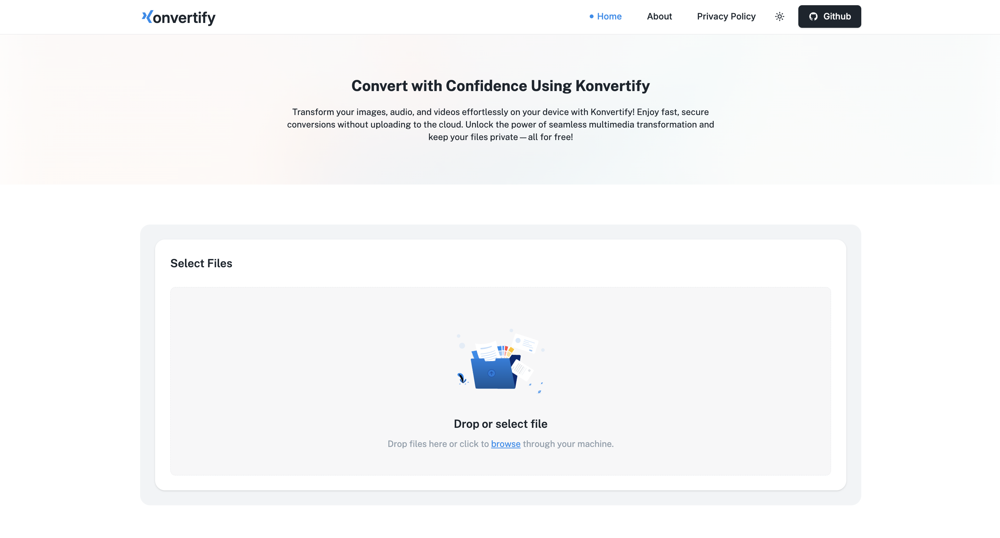
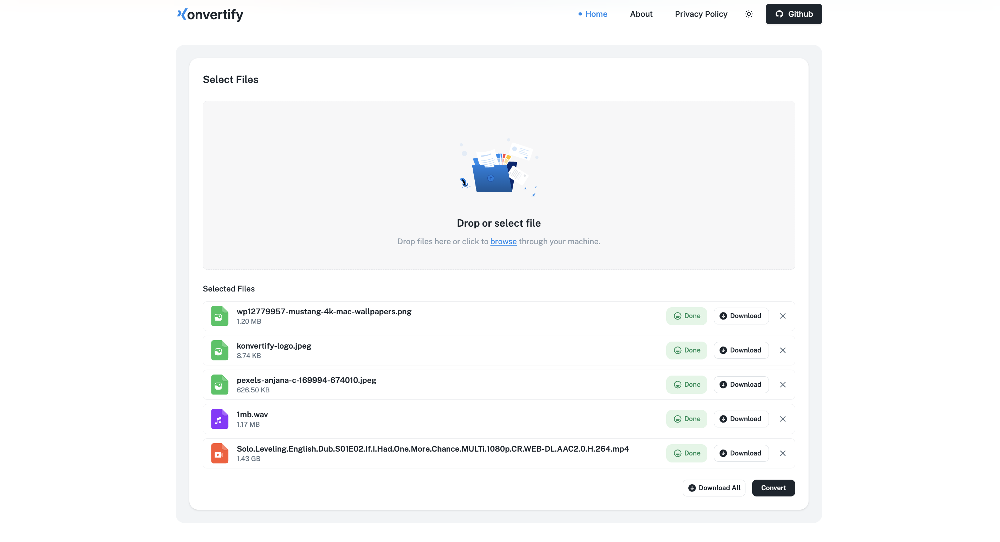

# Konvertify


**Convert any file, effortlessly. Free, Unlimited, and Secure.** Powered by WebAssembly and FFmpeg.

## Overview

Konvertify is a free and open-source file conversion tool that puts your privacy first. By leveraging the power of WebAssembly and FFmpeg, all conversions happen directly in your browser – no uploading, no waiting. Convert images, audio, and video files without sacrificing security or control.



## Key Features

- **Local File Conversion:** Your files never leave your device.
- **Wide Format Support:** Convert between a variety of popular image, audio, and video formats.
- **Free and Unlimited:** No limitations on file size or the number of conversions.
- **Secure and Private:** Conversions happen locally, so your data stays safe.
- **Easy to Use:** A simple and intuitive interface makes file conversion accessible to everyone.



## Technology Stack

Konvertify is built with:

- [Vite](https://vitejs.dev/)
- [React](https://react.dev/)
- [TypeScript](https://www.typescriptlang.org/)
- [Shadcn UI](https://ui.shadcn.com/)
- [Tailwind CSS](https://tailwindcss.com/)
- [@ffmpeg/ffmpeg](https://www.npmjs.com/package/@ffmpeg/ffmpeg)
- [TanStack Router](https://tanstack.com/router)

## Installation

To run Konvertify locally, follow these steps:

1.  **Clone the repository:**

    ```
    git clone https://github.com/imkrrish/konvertify.git
    cd konvertify
    ```

2.  **Install dependencies:**

    ```
    npm install
    ```

3.  **Build the project:**

    ```
    npm run build
    ```

4.  **Start the development server:**

    ```
    npm run dev
    ```

    Visit `http://localhost:5173` in your browser. (Or another port which is specified in the terminal)

## Usage

1.  Open Konvertify in your browser.
2.  Drag and drop a file or click to select one from your computer.
3.  Choose the desired output format.
4.  Click the "Convert" button.
5.  Once the conversion is complete, download your converted file.

## Contributing

We welcome contributions to Konvertify! If you'd like to contribute, please follow these steps:

1.  Fork the repository.
2.  Create a new branch for your feature or bug fix.
3.  Make your changes and commit them with clear, descriptive messages.
4.  Submit a pull request.

Please adhere to the existing code style and conventions.

## Support

If you have any questions or encounter any issues, please open an issue on the [GitHub repository](https://github.com/imkrrish/konvertify/issues)
